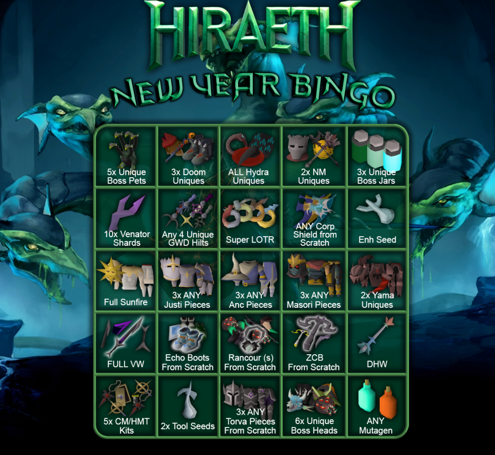
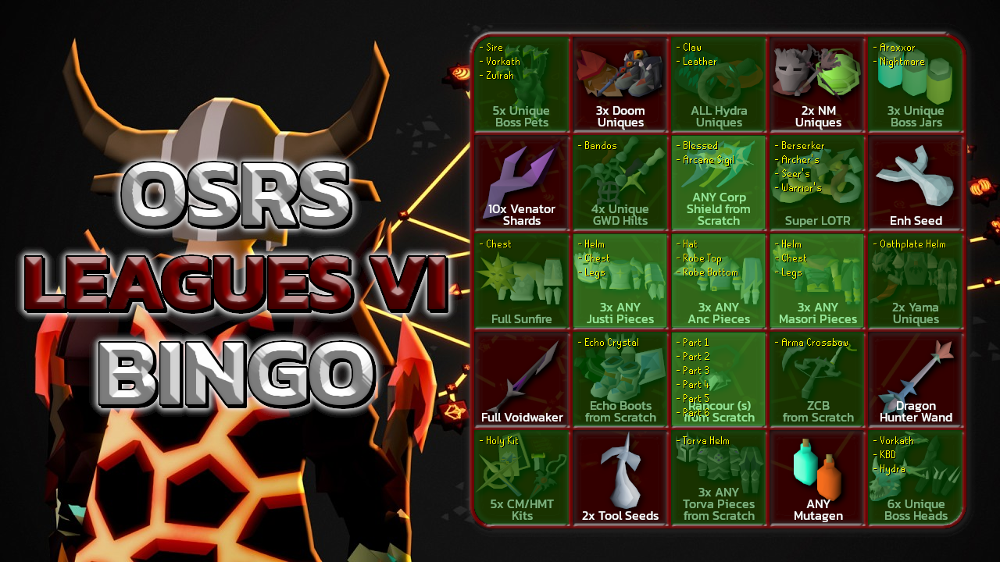

# Bingo Updater

Takes bingo board image and JSON checklist (from Discord bot, etc.) and generates updated board image.

**TODO:** Handle wrapping & columns for text overflow.

## Example

**Before:**

**After:**

